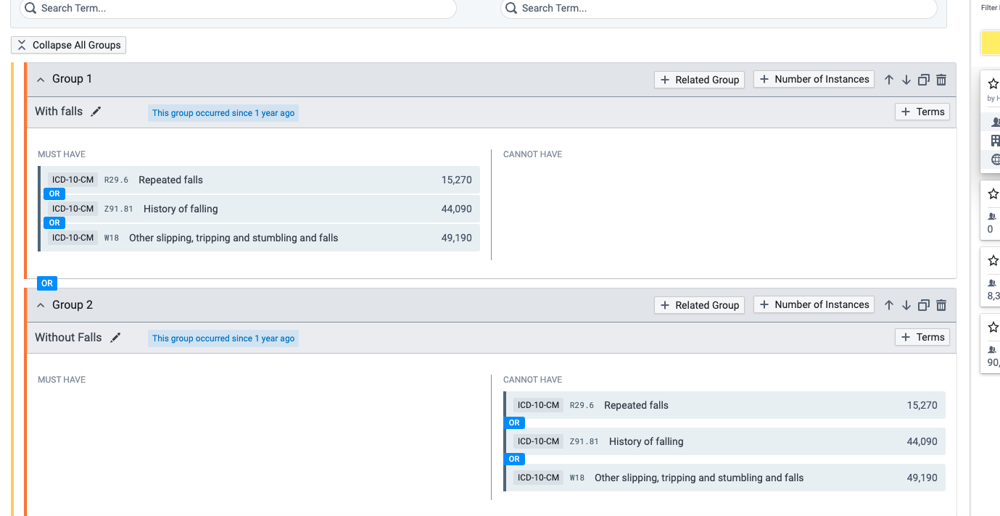

# About Data

This data originated from a TriNetX search, in which two groups were generated:

- Group 1: Hx Falls 
- Group 2: No Hx Falls 

Falls is simply defined as either having or not have one of three ICD codes: 
1. R29.6
2. Z91.81
3. W18 

## Additional File 

There is one file that is too large for github (>200mb) that is called `standardized_terminology.csv` that contains all of the human readible values for the codes that are being utilized by TriNetX. 

Currently I have this made available here to download: 

[Google Shared Folder](https://drive.google.com/file/d/1c1jtgGZATeOjtQLGPOyJz22Xzr6LsFq4/view?usp=drive_link)

