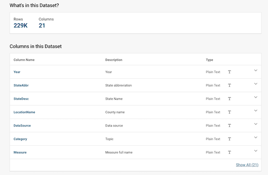

# Deploying Data Visualizations: Intro (6 slides)

**Hants Williams, PhD, RN**

---

# Updates to SQL slides from Mondays class: 

- [Github](https://github.com/hantswilliams/HHA_504_2023/blob/fb280af3e1ffd50afef8b30fbdcba5baedcd3527/WK3/slides/p2_sql_intro.md)

---

# Importance of Sharing Data

* Data Scientists play a critical role in making data accessible.
* Non-technical audiences need clear, understandable insights.

---

# The ETL Process

* **Extract (E)**: Retrieve raw data from sources.
* **Transform (T)**: Clean, modify, and shape the data into a useful format.
* **Load (L)**: Store back into a database or visualize in a report/dashboard.

---

# Why Visualize?

* Data on its own can be overwhelming and hard to understand.
* Visualization turns complex data into intuitive and actionable insights.
* Helps in decision-making, especially in critical sectors like health.

---

# Deploying Visualizations

* Beyond creating, **sharing** is key.
* Dashboards: Central platforms to display and interact with your visuals.
* Tools in Python and R enable easy dashboard creation.

---

# Approaches 

* Juypter Notebooks 
* Python and R based Dashboards (Streamlit, Shiny)
* Web Frameworks (Flask, Django, FastAPI)
* Underlining open-source libraries (Matplotlib, Seaborn, Plotly, GGPLOT2)
* 3rd party stand alone solutions (Tableau, Power BI)
* Embedded/Integrated BI Tools (Looker, Sisense) 

---

# Expectations with Code Examples 

- We'll be deploying code examples from GitHub in environments like Google Shell or posit.cloud (especially for R code).
- Some code examples contain advanced Python constructs (like decorators) we haven't covered in depth.
- **Main Expectation**: Ability to adapt and build upon the base code. Swapping dataframes, variables, and understanding the structure are key.

---

# Emphasis on Adaptability

The tools and methods we're covering have diverse applications. The main goal isn't to master every intricacy but to:

1. Understand the broad landscape of data visualization tools.
2. Identify the right tool for the right job.
3. Adapt and extend base code examples for specific needs.

---
# Main datset

We will use a single dataset for reviewing these approaches tonight: `CDC Places: Local Data for Better Health, County Data 2023 Release`.

*Data origin*: [CDC.gov](https://data.cdc.gov/500-Cities-Places/PLACES-Local-Data-for-Better-Health-County-Data-20/swc5-untb)

