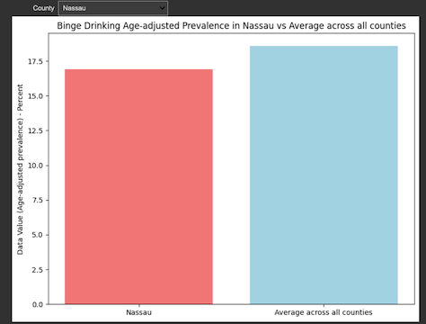

# Jupyter Notebooks for Visualization (10 slides)

---

# What is a Jupyter Notebook?

* An open-source tool that lets you create and share live code, equations, visualizations, and narrative text.
* Supports multiple programming languages, including Python, R, Julia, SQL, Stata, and more.

---

# Benefits 

* Live interaction with data: Play with parameters, see immediate results.
* Combines code, output visuals, and descriptive text in one place.
* Easy to share, making it ideal for interdisciplinary collaboration.

---

# Sharing with Non-Technical Users

1. **Static Format**: Export as a PDF or HTML.
2. **Interactive**: Share the `.ipynb` file directly or via platforms like GitHub.
3. **Web Applications**: Convert Notebooks to web apps using tools like Voilà.

---

# Example: CDC Data 

Notebook: [WK4/examples/jupyter/cdc.ipynb](WK4/examples/jupyter/cdc.ipynb)
Data Origin: [CDC 500 Cities](https://data.cdc.gov/500-Cities-Places/PLACES-Local-Data-for-Better-Health-County-Data-20/swc5-untb)

To export the notebook as an HTML or PDF:

- For HTML: File -> Download as -> HTML (.html)
- For PDF: File -> Download as -> PDF via LaTeX (.pdf)

---

# Jupyter Exports

To HTML: 

```shell
!jupyter nbconvert --to html PATH_TO_THE_NOTEBOOK_IN_COLAB.ipynb
```

To PDF: 

```shell
!sudo apt-get install texlive-xetex texlive-fonts-recommended texlive-plain-generic
!jupyter nbconvert --to pdf PATH_TO_THE_NOTEBOOK_IN_COLAB.ipynb
```

---

# Jupyter Extensions for Enhanced Visualization

* **jupyter-widgets/ipywidgets**: Interactive HTML widgets for Jupyter notebooks.

Installation within Google Colab cell:

```shell
!pip install ipywidgets
```

Ensuring that they are activated:

```shell
!jupyter nbextension enable --py widgetsnbextension
```

If working within Google Shell, will also need to pip install Jupyter and extensions
```shell
pip install jupyter jupyter_contrib_nbextensions
```

---

# Ipywidgets 

Interactive dropdown in the notebook:




---

# Ipywidgets 

```python

import ipywidgets as widgets

# Compute the average data value across all counties
avg_data_value = df['Data_Value'].mean()

# Sort the counties in ascending order for the dropdown list
sorted_counties = sorted(df['LocationName'].unique())

# Interactive selection of county for visualization using ipywidgets
@widgets.interact(County=sorted_counties)
def plot_data(County):
    county_value = df[df['LocationName'] == County]['Data_Value'].values[0]
    
    # Labels for bars
    labels = [County, 'Average across all counties']
    
    # Data values for bars
    values = [county_value, avg_data_value]
    
    plt.figure(figsize=(8, 6))
    
    # Plot the bars
    colors = ['lightcoral', 'lightblue']
    plt.bar(labels, values, color=colors)
    
    plt.ylabel('Data Value (Age-adjusted prevalence) - Percent')
    plt.title(f'Binge Drinking Age-adjusted Prevalence in {County} vs Average across all counties')
    
    plt.tight_layout()
    plt.show()

```

---


# Voilà: From Notebook to Web App

* Converts Jupyter Notebooks into standalone web applications.
* Users can interact with data without seeing the underlying code.
* Perfect for sharing insights with those who don’t need/want to see the code.

---

# Google Shell with Violà - Notebook

In the future in 504, we will see how we can deploy `voila` using a VM in Azure or GCP as well...

1. `pip install voila jupyter_server`
2. Create or load the notebook
3. Run viola: `voila your_notebook_name.ipynb`

Voilà supports different layouts and templates. By default, it uses the full layout, which displays your app taking up the entire browser window. But you can also choose the 'grid' layout which arranges outputs in a grid.

To use the grid layout:
```shell
voila your_notebook_name.ipynb --template=grid
```

---

# Best Practices

* **Clear Documentation**: Ensure each step is clearly documented.
* **Hide Code Cells**: For non-technical users, show only the outputs and relevant text.
* **Regularly Update**: Ensure data sources and visualizations are up-to-date.


