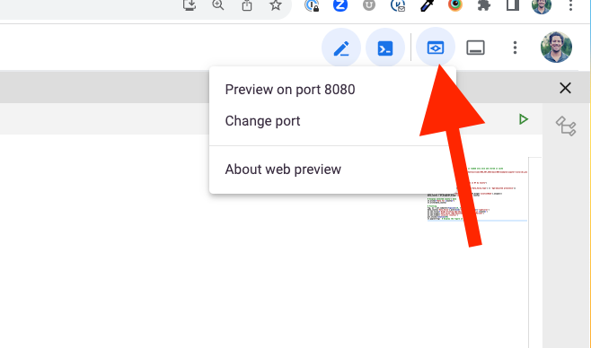

# Streamlit for Health Informatics (6 slides)

Streamlit offers a rapid way to turn data scripts into interactive web applications.

---

## Why Use Streamlit?

- 🚀 **Fast** - Develop interactive apps rapidly.
- 🛠️ **Easy** - No need for deep web development skills.
- 🔧 **Pythonic** - Write apps in simple Python scripts.
- 🌐 **Shareable** - Easily deploy and share your apps.

---

## Key Features

1. Streamlit **caching** speeds up data-heavy applications.
2. Intuitive **widgets** (e.g., sliders, buttons) for interactivity.
3. Seamless integration with **data visualization libraries**.
4. **Deployment solutions** for sharing apps with the world.

---

## Streamlit in Health Informatics

- Visualize **patient statistics** across different parameters.
- Explore **treatment outcomes** using interactive charts.
- Share **findings** and **research** with peers through web interfaces.
- Create **dashboards** for monitoring health metrics.

---


## Example: Binge Drinking in NY

We transformed the CDC dataset on binge drinking across NY counties into an interactive web app.

- Users can **select a county** and view its data.
- **Bar charts** visualize age-adjusted prevalence.
- Allows for quick **data exploration** and **comparisons**.

---

## Running it in dev (google shell cloud)

1. Install Streamlit:
   ```bash
   pip install streamlit
   ```

2. Run your app: 
    ```bash
    streamlit run your_app_script.py
    ```

When running in shell, will need to add: ` --server.port=8080 --server.enableCORS=false` This will run in on port 8080, and we disable CORS which is a security functioanlity to be able to deploy it within our google shell test environment.  So the command for our example looks like:

```bash
streamlit run cdc.py --server.port=8080 --server.enableCORS=false'
```

---

When running, you will need to enable the preview by clicking up on the top right of the screen, and making sure that your reployment PORT (telephone number) matches the port you have deployed it on:

