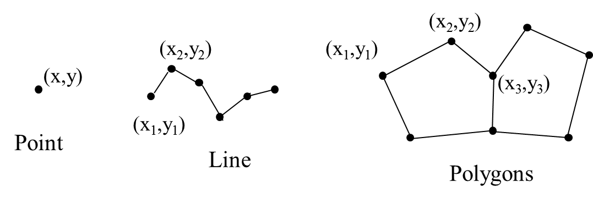
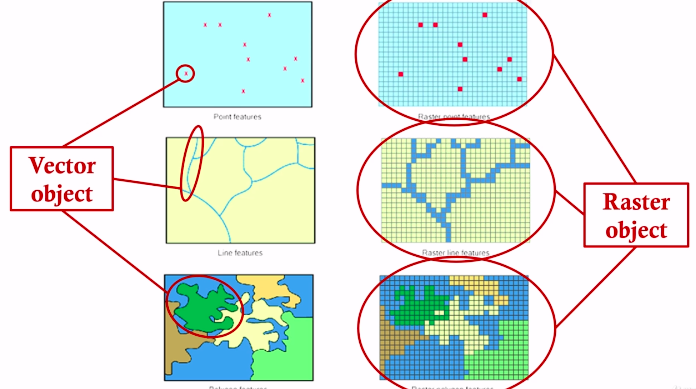
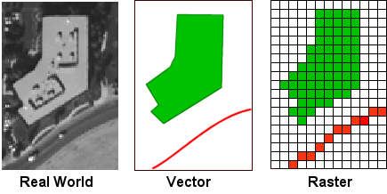
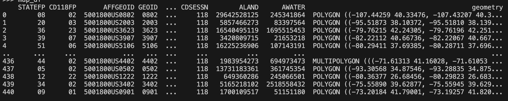
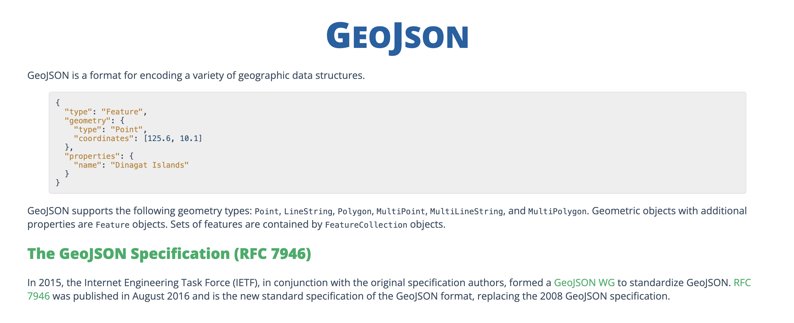
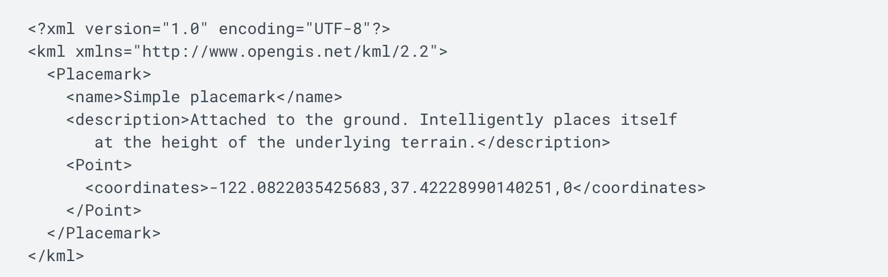

# Understanding Geospatial Data

**Hants Williams, PhD, RN**

---

## What is Geospatial Data?
- Represents information about objects or phenomena located on or near the Earth's surface.
- Often in the form of coordinates (latitude, longitude).
- **Prevalence in Today's World**:
  - Geospatial data is ubiquitous and plays a crucial role in various applications, from navigation and logistics to environmental monitoring and urban planning.
  - In healthcare, geospatial data is used to map disease outbreaks, analyze access to healthcare facilities, and study the relationship between health outcomes and environmental factors.

---

## Types of Geospatial Data

- **Common Attributes**:
  - May include other attributes such as temperature, population density, land use, and more.

### Vector Data
- **Type**: Discrete objects represented by geometric shapes.
- **Points**: Specific locations on a map, such as hospitals or clinics.
- **Lines**: Connections between points, such as roads or patient travel paths.
- **Polygons**: Enclosed areas, such as city boundaries or hospital service areas.

---


---



---

## Types of Geospatial Data (cont'd)

### Raster Data
- **Type**: Continuous phenomena represented by grid cells.
- **Characteristics**: Each cell holds a value representing a specific attribute, such as temperature or elevation.
- **Applications**: 
  - Satellite imagery: Used to monitor land cover, vegetation health, and other environmental factors.
  - Digital elevation models: Represent the Earth's surface and can be used to analyze terrain, watershed, and flood risk.
- **Healthcare Example**: 
  - Analyzing environmental factors (e.g., air quality, temperature) in relation to health outcomes such as asthma or infectious diseases.

---




- Raster data is data that is presented in a grid of pixels. 
- Each pixel within a raster has a value, whether it be a colour or unit of measurement. 

---



- Raster data is data that is presented in a grid of pixels.
- Vector data is data that is presented in points, lines, and polygons.
- Real photo represents real world objects.
---

## Common Geospatial Formats
- **Shapefile (.shp)**
  - A popular vector data format for geographic information system (GIS) software.
  - Consists of a set of files that store geometries and attributes.
  - Widely used for storing map data such as boundaries, roads, and points of interest.



---
- **GeoJSON (.geojson)**
  - A format for encoding geographic data structures using JSON.
  - Commonly used for web-based mapping applications due to its compatibility with JavaScript.
  - Supports points, lines, polygons, and other geometric shapes.
  - https://geojson.org/

---

  

---

## Common Geospatial Formats (cont'd)

- **KML (.kml)**
  - A file format used to display geographic data in mapping software like Google Earth.
  - Stores data in XML format and supports placemarks, paths, and polygons.
  - Useful for creating interactive maps that can be shared and viewed on various platforms.

---



---

## Tools for Geospatial Analysis
- **Python Libraries**:
  - `geopandas`
  - `folium`
  - `matplotlib`

---
## geopandas
- **Type**: Analysis and Visualization
- **Description**: Extends the datatypes used by pandas to allow spatial operations on geometric types.
- **Ease of Use**: Moderate
- **Strengths**: 
  - Powerful for spatial analysis
  - Integrates well with other Python libraries for data analysis


---

## folium
- **Type**: Visualization
- **Description**: Allows for easy creation of interactive maps with Leaflet.js.
- **Ease of Use**: Easy
- **Strengths**: 
  - Great for web-based maps
  - Wide range of plugins for additional map features

---
## matplotlib
- **Type**: Visualization
- **Description**: A comprehensive plotting library that can be used for creating static maps.
- **Ease of Use**: Moderate
- **Strengths**: 
  - Highly customizable plots
  - Integrates well with other Python data analysis libraries

---

## Additional Tools for Consideration
- **Rasterio**: For working with raster data.
- **Shapely**: For manipulation and analysis of geometric objects.
- **Cartopy**: For map projections and geospatial data visualization.

---

## Additional Tools for Consideration (non-python)
- **Other Tools**:
  - ArcGIS: A comprehensive GIS for working with maps and geographic information.
  - Google Maps: A web-based map service from Google.

---

## ArcGIS
- **Type**: Comprehensive GIS
- **Description**: A powerful platform for working with maps and geographic information.
- **Ease of Use**: Moderate to Hard
- **Strengths**: 
  - Extensive set of tools for analysis and visualization
  - Widely used in professional GIS communities

---


## Google Maps
- **Type**: Web-based Map Service
- **Description**: Provides maps, satellite imagery, and route planning services.
- **Ease of Use**: Easy
- **Strengths**: 
  - User-friendly interface
  - Integrates well with other Google services and APIs for customized maps


---

## Acquiring Geospatial Data

- **Sources**:
  - Data.gov
    - Filter by "geospatial" to find datasets with geospatial information.
    - https://catalog.data.gov/dataset/?_res_format_limit=0&res_format=GeoJSON 
  - Government databases: 
    - USGS Earth Explorer for satellite imagery and elevation data.
  - Open data platforms: 
    - GeoCommons
    - OpenStreetMap
  - Commercial data providers: 
    - Esri
    - Google Maps API


---


## Loading and Cleaning Data

- **Loading Data**:
  - Import data into a Python environment using libraries such as `geopandas`.
  - Ensure proper encoding and format for geospatial attributes.

---

## Geocoding Services for Data Cleaning
- **Geocoding**:
  - The process of converting addresses into geographic coordinates (latitude and longitude).
- **Reverse Geocoding**:
  - The process of converting geographic coordinates into human-readable addresses.
  - Use Google Maps API or USPS API to correct inconsistent or missing geographic coordinates in your health facility dataset.
- **Services**:
```text
  - Google Maps API: Provides geocoding, reverse geocoding, and other location-based services.
  - OpenStreetMap Nominatim API: A free geocoding service with global coverage.
  - USPS Address Information API: Provides address validation and may include geolocation for shipping and mailing purposes.
```


---

## Geocoding and Data Cleaning with ESRI/ArcGIS

- **Geocoding and Reverse Geocoding**:
  - ArcGIS provides robust geocoding and reverse geocoding services.
  - Convert addresses to geographic coordinates and vice versa.
- **Data Cleaning and Validation**:
  - ArcGIS offers various tools for data cleaning and validation, including:
    - Detecting and correcting errors in geographic data.
    - Standardizing location data for consistency.
- **Spatial Analysis**:
    - Identifying patterns and relationships in geographic data.
    - Analyzing the spatial distribution of X (variable) factors.

---

## Geocoding and Data Cleaning with Tableau

- **Geocoding**:
  - Tableau provides built-in geocoding for common geographic data, such as countries, states, and cities.
  - Users can also import custom geocoding data for more specific location information.
- **Reverse Geocoding**:
  - Tableau does not have reverse geocoding capabilities.
- **Data Cleaning and Validation**:
  - Tableau offers various tools for cleaning and transforming data, but they are non-unique (merge, split, pivot, etc.).
- **Spatial Analysis**:
    - Spatial joins to combine different geographic datasets.
    - Distance calculations to analyze proximity between locations.

---

## Static Mapping with Python
- Use `geopandas`, `folium`, or `matplotlib` to create static maps.
- Can use color scales, markers, etc. to visualize data.
- Consider the audience and purpose of the map.
- **When to Use Static Maps**:
  - Ideal for printed materials or presentations where interaction is not possible.
  - Useful when a simple, clear, and concise message needs to be conveyed without the need for user interaction.
  - Examples include demographic maps, land use maps, and location-based data visualizations in reports or research papers.


---

## Interactive Mapping with Python
- **Libraries**:
  - Use `folium` or `plotly` to create interactive maps.
- **Interactive Elements**:
  - Add pop-ups, zoom capabilities, and other interactive features to engage users.
- **When to Use Interactive Maps**:
  - Ideal for web-based platforms where user engagement and exploration are encouraged.
  - Useful for complex datasets where users may want to drill down into specific data points or regions.
  - Examples include public health dashboards, interactive research tools, and web applications.

---

## Common Geospatial Analyses
- Calculate distances between points.
- Calculate density of specific sites around geomarkers.
- Identify clusters of data points.
- Analyze spatial relationships between different layers of data.

---

## Common Geospatial Analyses (cont'd)

- **Calculate Distances Between Points**:
  - Measure the distance between healthcare facilities and patient homes.
  - Calculate the travel time for patients to reach the nearest hospital.
- **Calculate Density of Specific Sites Around Geomarkers**:
  - Assess the density of clinics in a specific area to identify gaps in healthcare access.
  - Analyze the distribution of specialized healthcare services in relation to population density.

---

## Common Geospatial Analyses (cont'd)

- **Identify Clusters of Data Points**:
  - Identify clusters of disease outbreaks or health conditions in specific geographic regions.
  - Find clusters of healthcare facilities that are serving high-need populations.
- **Analyze Spatial Relationships Between Different Layers of Data**:
  - Examine the relationship between environmental factors (e.g., air quality, water quality) and health outcomes.
  - Analyze the impact of social determinants of health (e.g., income, education) on healthcare access and outcomes.

---

## Conclusion and Next Steps
  - Performing geocoding (reverse geocoding) to clean and validate data with GCP (API example)
  - Now move on to some practical examples using Python to generate both static and dynamic maps.
  - Demonstrate examples of common geospatial **analyses** in healthcare.

