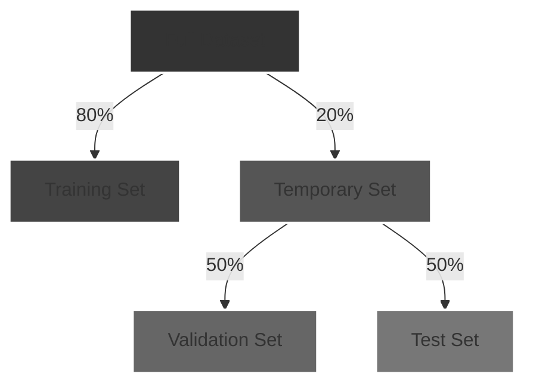

```mermaid

graph TD
    A[Full Dataset] -->|80%| B[Training Set]
    A -->|20%| C[Temporary Set]
    C -->|50%| D[Validation Set]
    C -->|50%| E[Test Set]

    style A fill:#333,stroke:#fff,stroke-width:2px
    style B fill:#444,stroke:#fff,stroke-width:2px
    style C fill:#555,stroke:#fff,stroke-width:2px
    style D fill:#666,stroke:#fff,stroke-width:2px
    style E fill:#777,stroke:#fff,stroke-width:2px

```

**Splitting with `train_test_split` from `sklearn.model_selection`**