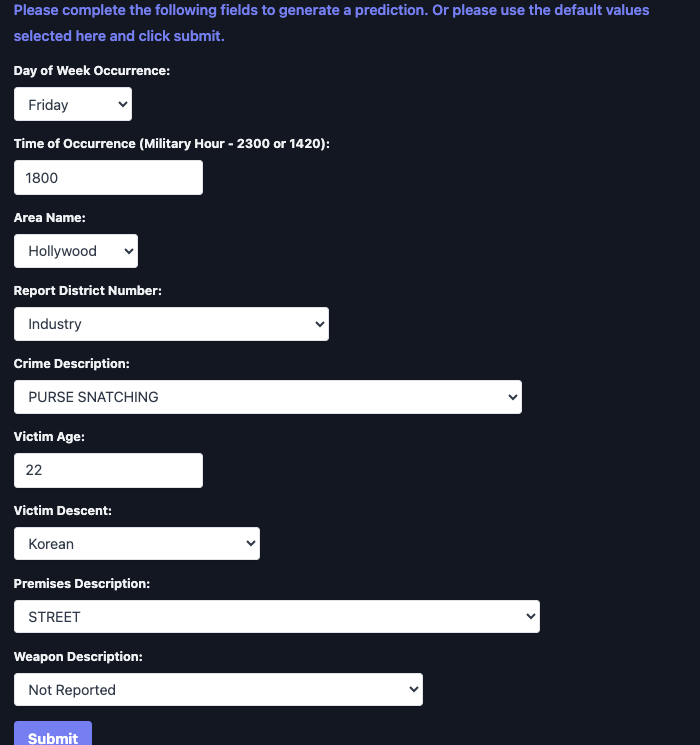

# LA Crime Data Prediction 

## **Objective**:
Gain hands-on experience with ML models, understanding their assumptions, and applying them to real-world datasets to understand differences among group means.

## Outcome:

### Example inputs for a crime that is likely to impact a male:

### Example prediction for a crime that is likely to impact a male, and is predicting a crime that is likely to impact a biological male:

### Example inputs for a crime that is likely to ipact a female:

### Example prediction for a crime that is likely to impact a female, and is predicting a crime that is likely to impact a biological female:

